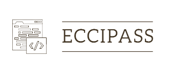

# Universidad de Costa Rica
## EcciPass



&nbsp;
## Desarrolladores

Andrés Azofeifa García B90837

Manuel Fernández Carrillo B72892
&nbsp;

&nbsp;
## Necesidad Identificada

En la Escuela de Computación e Informática de la UCR se debe llenar un formulario cada vez que una persona estudiante, profesor o invitado ingresa con un activo electrónico. Este puede ser una computadora personal, una tablet o un periférico. Este proceso de llenar el formulario con los datos del activo es para meyor seguridad de la escuela pero puede llegar a ser muy tedioso. 

&nbsp;

Se deben llenar datos personales, datos del activo y por último los datos del guarda que se encuentra presente. La escuela implementó el sello de este formulario para que sea válido en todo momento, pero el proceso de validación del mismo puede depender del día y la hora. 

&nbsp;

Todos estos elementos en conjunto han hecho que el proceso de llevar un activo a la escuela sea sumamente lento y poco eficiente. En el contexto de la solución se pretende crear una plataforma electrónica que pueda solucionar todos los inconvenientes resaltados anteriormente, se busca una solución ágil y segura donde ambas partes puedan estar satisfechas.

&nbsp;

## Solución Propuesta

ECCIPass será la plataforma que se estará desarrollando para solucionar esta problemática. Mediante una interfaz moderna, cualquier persona podrá ingresar y así registrar sus activos electrónicos. Para esto, se tendrá que proporcionar el modelo, la marca, el número de serie y una imágen del activo. 

&nbsp;

Para el control y seguridad de la escuela, solo los administradores podrán aprobar nuevos activos. Al ser aprobados. Se generará un código QR con toda la información necesaria. No se tendrá que llenar boletas nuevas ni esperar a que se sellen las mismas.

&nbsp;

La plataforma se estará desarrollando en React. Donde se estarán usando diferentes librerías (íconos y generador de QR) para hacer la experiencia de usuario más completa. Para los estilos se utilizará Tailwind como fue acordado en el documento y en clase. Nuestra plataforma puede ser utilizada en cualquier tipo de computadora y en dispositivos móviles. Esta será programada de forma que se ajuste a las dimensiones de los dispositivos que utilice el usuario día a día.

&nbsp;

## Comandos y paquetes utilizados
&nbsp;
### Correr solución
``` npm run start ```

&nbsp;

### Redux
``` npm install @reduxjs/toolkit ```

&nbsp;

### QR Code Generator
``` npm install react-qr-code ```

&nbsp;

### React Icons
``` npm install react-icons ```

&nbsp;

### TailwindCss
``` npm install -D tailwindcss ```
``` npx tailwindcss init ```


